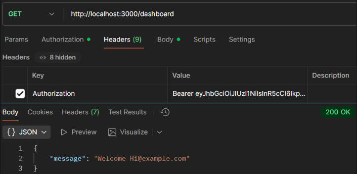

# Experiment 12: Secure Routes using JWT Authentication (CO4)

---
## Screenshots

Here’s a preview of the app:




## 🎯 Objective
- Use JWT for authentication.  
- Restrict access to logged-in users.  
- Protect sensitive API routes.  

---

## ⚙ Setup

```bash
mkdir jwt-auth-api
cd jwt-auth-api
npm init -y
npm install express mongoose body-parser bcrypt jsonwebtoken# Experiment 12: Secure Routes using JWT Authentication (CO4)

---
## Screenshots

Here’s a preview of the app:


## 🎯 Objective
- Use JWT for authentication.  
- Restrict access to logged-in users.  
- Protect sensitive API routes.  

---

## ⚙ Setup

```bash
mkdir jwt-auth-api
cd jwt-auth-api
npm init -y
npm install express mongoose body-parser bcrypt jsonwebtoken
